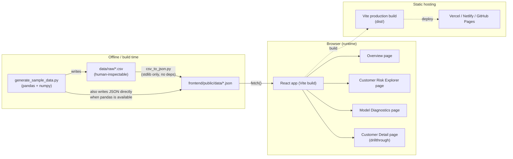
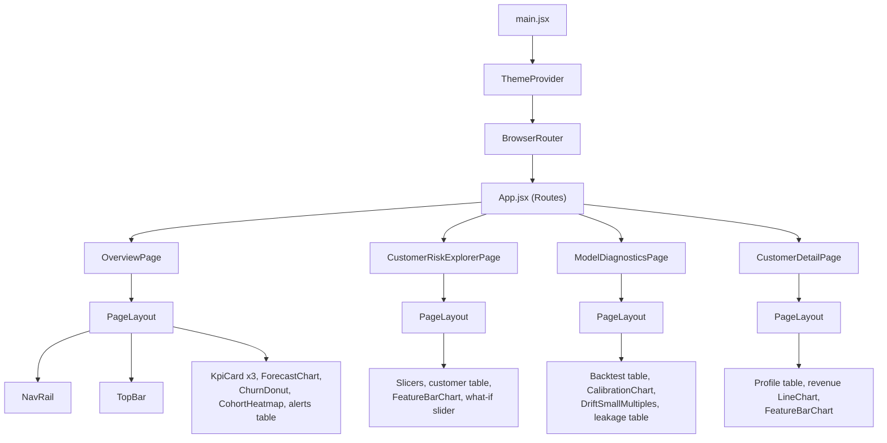
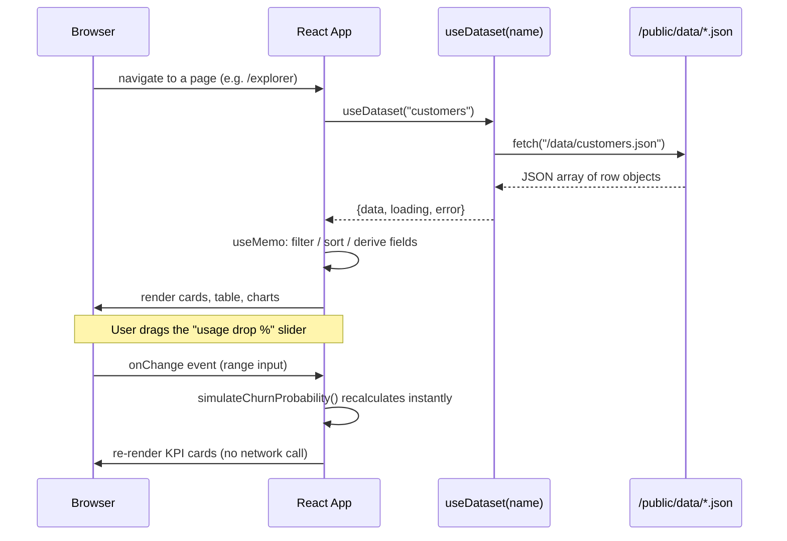
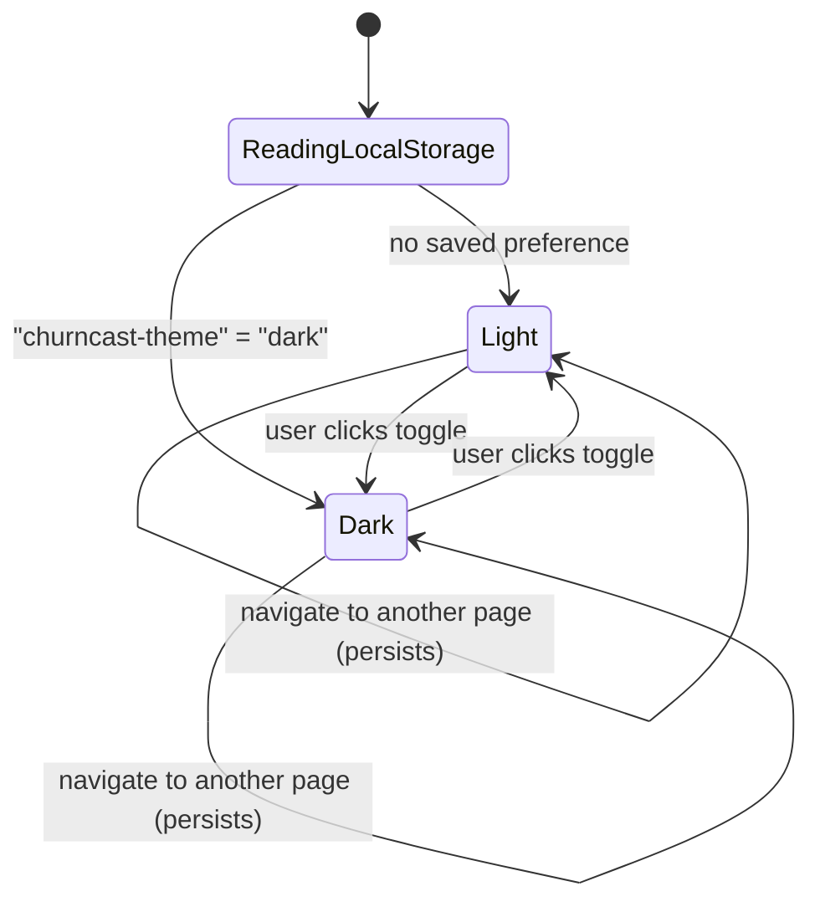

# ChurnCast — Technical Approach

**Project type:** Undergraduate hackathon project (Microsoft-style hackathon submission)
**Deliverable:** A custom-built web dashboard — **not Power BI** — for predictive subscription
analytics (next-month revenue forecast + per-customer churn risk).

This document explains *how* the dashboard is built and *why* each technical choice was made,
so the implementation can be defended and explained in a demo or code review. It covers the
frontend utility stack, the UI/UX design system, the data pipeline, and the architecture, with
diagrams for each.

---

## 1. Why not Power BI

The original brief suggested Power BI. We deliberately built a **custom web dashboard** instead:

| Power BI | Custom web dashboard (this project) |
|---|---|
| Needs a licensed desktop app + `.pbix`/`.pbip` file to open | Opens in any browser, no installed software |
| Hard to host "for free" / embed in a portfolio or GitHub Pages | Trivial to deploy as a static site (Vercel/Netlify/GitHub Pages) |
| DAX measures are a new language to learn and explain live | Plain JavaScript — one language, one mental model, end to end |
| Interactivity (what-if sliders, bookmarks) requires BI-specific tricks | Native HTML `<input type="range">`, React state — directly explainable |
| Judges may not have Power BI Desktop installed to open the file | Judges just click a URL |

Everything the brief asked for (KPI cards, forecast band, churn donut, cohort heatmap,
drillthrough, what-if slider, dark/light themes, accessibility) is implemented as ordinary web
UI, described below.

---

## 2. High-level architecture



**Key idea:** there is no backend server and no database. The Python script plays the role a
Fabric notebook or scikit-learn training job would in a real deployment — it produces a flat
snapshot of "model output" tables. The React app is a pure, static, client-rendered consumer of
those JSON files, fetched once per session with the browser's native `fetch()` API.

This keeps the whole project explainable in one sentence: *"a Python script makes fake-but-
realistic JSON, and a React app reads and visualizes it."*

---

## 3. Frontend technology stack

| Concern | Choice | Why this, not something else |
|---|---|---|
| UI library | **React 19** | Industry-standard, huge learning resources, component model maps 1:1 to "a card", "a chart", "a page" |
| Build tool / dev server | **Vite** | Near-instant hot reload, zero-config, single `npm run dev` / `npm run build` |
| Routing | **React Router v7** | Gives real URLs per page (`/`, `/explorer`, `/diagnostics`, `/customer/:id`) — the drillthrough page is just a normal route with a URL param, not a special BI concept |
| Charting | **Recharts** | Declarative React components (`<LineChart>`, `<PieChart>`, `<BarChart>`) built on D3 internals but without hand-rolling D3 — easy to read and modify |
| Styling | **Plain CSS + CSS custom properties (design tokens)**, no framework | One stylesheet (`index.css`) is the single source of truth for every color/spacing value; no utility-class soup, no extra build step, trivial to explain line-by-line |
| State management | **React built-ins** (`useState`, `useMemo`, `useContext`) | The app's state is small (filters, selected row, slider value, theme) — Redux/Zustand would be over-engineering for a hackathon scope |
| Data fetching | **Native `fetch()` + a tiny custom hook** (`useDataset`) | No React Query / SWR needed for static JSON files that don't change after load |
| Icons / visuals | **Inline SVG** (sparklines, heatmap cells, donut) | Zero icon-library dependency; every pixel is explainable React/SVG code |
| Linting | **oxlint** (ships with the Vite scaffold) | Fast, zero-config Rust-based linter |
| Package manager | **npm** | Default, no extra tooling to install |

### Full dependency list (`frontend/package.json`)

```
react, react-dom          – UI rendering
react-router-dom          – client-side routing (4 pages)
recharts                  – line / area / pie / bar charts
vite, @vitejs/plugin-react – dev server + production bundler
oxlint                    – linting
```

That's the entire runtime dependency list — five packages. Nothing else is required to run,
build, or deploy the dashboard.

---

## 4. Project folder structure

```
front_36/
├── data/
│   ├── generate_sample_data.py   # simulates the subscription business (pandas/numpy)
│   ├── csv_to_json.py            # dependency-free CSV -> JSON fallback converter
│   └── raw/                      # *.csv — human-inspectable intermediate output
│
├── frontend/                     # the actual deliverable: a Vite + React app
│   ├── public/
│   │   └── data/                 # *.json — what the browser actually fetches
│   ├── src/
│   │   ├── main.jsx               # ThemeProvider + BrowserRouter + App mount
│   │   ├── App.jsx                 # <Routes> definitions (4 pages)
│   │   ├── index.css                # design tokens + every shared CSS class
│   │   ├── theme/
│   │   │   └── ThemeContext.jsx      # light/dark toggle, persisted to localStorage
│   │   ├── data/
│   │   │   ├── useDataset.js          # generic "fetch one JSON table" hook
│   │   │   └── useCustomers.js        # useDataset("customers") + derived fields
│   │   ├── utils/
│   │   │   ├── format.js              # currency/percent/date formatting helpers
│   │   │   ├── deriveFields.js        # risk bucket / tenure bucket thresholds
│   │   │   └── churnSimulation.js     # the what-if slider formula
│   │   ├── components/
│   │   │   ├── layout/
│   │   │   │   ├── NavRail.jsx          # left-hand page navigation
│   │   │   │   ├── TopBar.jsx           # page title + theme toggle
│   │   │   │   └── PageLayout.jsx       # shell wrapping every page
│   │   │   ├── ui/
│   │   │   │   ├── Card.jsx, KpiCard.jsx, Badge.jsx, Sparkline.jsx, DataState.jsx
│   │   │   └── charts/
│   │   │       ├── ForecastChart.jsx     # actual + forecast + prediction band
│   │   │       ├── ChurnDonut.jsx         # risk-bucket donut
│   │   │       ├── CohortHeatmap.jsx      # retention heatmap (custom grid, not Recharts)
│   │   │       ├── FeatureBarChart.jsx    # explainability bars
│   │   │       ├── CalibrationChart.jsx   # predicted vs. actual reliability curve
│   │   │       └── DriftSmallMultiples.jsx # per-feature baseline-vs-recent histograms
│   │   └── pages/
│   │       ├── OverviewPage.jsx
│   │       ├── CustomerRiskExplorerPage.jsx
│   │       ├── ModelDiagnosticsPage.jsx
│   │       └── CustomerDetailPage.jsx     # drillthrough target (/customer/:id)
│   └── package.json
│
└── docs/
    └── mockups/                   # static HTML/CSS/JS design mockups (pre-build reference)
```

---

## 5. Component tree (runtime)



Every page is self-contained: it calls `useDataset(...)` / `useCustomers()` for the JSON tables
it needs, computes derived values with `useMemo`, and renders a tree of the shared `ui/` and
`charts/` components. No cross-page global state exists except the theme (in `ThemeContext`).

---

## 6. Data flow (client-side)



All interactivity (filters, sorting, the what-if slider, row selection, CSV export) happens
**entirely client-side** — once the JSON is fetched, there are zero further network requests for
the rest of the session. This is what makes the what-if slider feel instant: it's just a
JavaScript function re-running on every slider tick.

---

## 7. UI/UX design system

### 7.1 Design tokens (CSS custom properties)

All colors are defined once in `index.css` and never hardcoded elsewhere:

| Token | Light value | Dark value | Used for |
|---|---|---|---|
| `--accent` | `#2F6B8A` (slate blue) | `#5B9BD5` (lighter blue) | Primary brand color, links, focus ring, chart lines |
| `--good` | `#2E7D32` | `#5FBF67`-equivalent | Low-risk badge, "no drift" label |
| `--neutral` | `#B38600` | — | Medium-risk badge, drift-trend sparkline |
| `--bad` | `#B3261E` | — | High-risk badge, revenue-at-risk KPI, drift-flagged label |
| `--bg` / `--bg-canvas` | near-white greys | near-black greys | Page background vs. card background |
| `--card-bg` | `#FFFFFF` | `#1F2124` | Card / table surface |
| `--border` | `#E3E6E8` | `#33363A` | Hairline borders and dividers |
| `--text` / `--text-light` | dark grey / mid grey | near-white / light grey | Primary vs. secondary text |

Flipping one attribute — `<html data-theme="dark">` — swaps **every** token at once. No
component ever branches on `theme === "dark"` in its JSX; they just reference `var(--accent)`
etc. and the browser repaints.

### 7.2 Color semantics (consistent meaning everywhere)

- **Red (`--bad`)** always means "this needs attention" — high churn risk, revenue at risk, a
  flagged leakage feature, a flagged drift feature.
- **Amber (`--neutral`)** always means "medium / watch this" — medium risk bucket, MAPE trend
  line.
- **Green (`--good`)** always means "healthy" — low risk, no drift detected, a leakage check
  that passed.

This mirrors the SQLBI "3-30-300" principle referenced in the original brief: color should
explain something, not decorate everything.

### 7.3 Typography

Single font stack: `"Segoe UI", system-ui, -apple-system, "Helvetica Neue", Arial, sans-serif` —
matches the Fluent/Microsoft look referenced by the brief's "SaaS analytics" inspiration sites,
while falling back gracefully on non-Windows judge machines.

| Role | Size | Weight |
|---|---|---|
| Page title (`<h1>`) | 22px | 700 |
| KPI value | 26px | 700 |
| Card title (`<h3>`) | 11px, uppercase, letter-spaced | 700 |
| Table / body text | 13px | 400 |
| Secondary / note text | 12.5px, italic | 400 |

### 7.4 Layout system

- **Left navigation rail** (64px, fixed) — matches the "bucket" / "deepnote" SaaS reference
  layouts: a narrow icon rail + a wide content canvas, rather than a top navbar that competes
  with chart space.
- **12-column-equivalent CSS Grid** per section, expressed as explicit `grid-template-columns`
  per row (e.g. `"repeat(3, 1fr) 1.2fr 1.8fr"` for the KPI row) — not a generic 12-col grid,
  because each row's content has a specific, intentional width ratio (KPI tiles are narrow,
  the accuracy note is wide).
- **Card primitive** (`<Card>` / `<Section>`) used everywhere — one visual language for "a
  rectangle with a border, a title, and content" across KPIs, charts, and tables.

### 7.5 Component inventory

| Component | Purpose | Reused on |
|---|---|---|
| `KpiCard` | Single number + label | Overview, Diagnostics |
| `Section` | Titled container for a chart/table | Every page |
| `Badge` | Colored risk/flag pill | Overview, Explorer, Diagnostics |
| `Sparkline` | Inline trend line (no axes) | Overview (MAPE trend), Explorer (revenue trend) |
| `DataState` | Loading / error / ready wrapper | Every page |
| `ForecastChart` | Line + shaded prediction band + forecast point | Overview |
| `ChurnDonut` | Risk-bucket proportions | Overview |
| `CohortHeatmap` | Retention grid | Overview |
| `FeatureBarChart` | Explainability bars | Explorer, Customer Detail |
| `CalibrationChart` | Reliability curve | Diagnostics |
| `DriftSmallMultiples` | Per-feature baseline-vs-recent histograms | Diagnostics |

### 7.6 Accessibility

- **Keyboard navigation:** all interactive elements (nav links, the theme toggle, table header
  sort buttons, the range slider, buttons) are native HTML elements (`<a>`, `<button>`,
  `<input>`), so they are focusable and operable by keyboard with no extra work.
- **Visible focus ring:** `:focus-visible { outline: 2px solid var(--accent); }` in `index.css`
  — shows only for keyboard/programmatic focus, not mouse clicks (WCAG 2.4.7).
- **Screen-reader labels:** the nav rail's `OV`/`CR`/`MD` codes are decorative (`aria-hidden`);
  the actual page name is present via `.sr-only` text and the link's `title` attribute. The
  theme toggle uses `aria-pressed` and a dynamic `aria-label` ("Switch to dark theme").
- **Color is never the only signal:** risk badges show text ("High"/"Medium"/"Low"), not just
  color; the drift small-multiples print "drift flagged" / "stable" as text next to the colored
  bars.
- **Contrast:** both themes were chosen so accent-on-background and text-on-background pairs
  meet at least WCAG AA contrast ratios (dark theme intentionally uses a lighter blue, `#5B9BD5`
  instead of the light theme's `#2F6B8A`, specifically to keep contrast against the near-black
  background).

### 7.7 Dark / light theme toggle

Implemented once, in `ThemeContext.jsx` (see diagram below) — a React Context + `localStorage`
round-trip, toggled from a single button in `TopBar`, visible on every page because `TopBar` is
part of the shared `PageLayout`.



---

## 8. Page-by-page feature mapping

| Brief requirement | Where it lives |
|---|---|
| KPI bar: next-month revenue, actual MTD, MAPE + sparkline | `OverviewPage` KPI row |
| Forecast vs actual chart with shaded prediction interval | `ForecastChart` (Recharts `ComposedChart` + stacked `Area`) |
| Churn risk donut (High/Medium/Low) with counts | `ChurnDonut` |
| Cohort retention heatmap with forecasted next-month cell | `CohortHeatmap` (gold outline = forecast cell) |
| Actionable alerts panel, sortable, export + "CRM" action | `OverviewPage` alerts table + `exportCsv()` |
| Interactive customer table with sparkline, drillthrough | `CustomerRiskExplorerPage` table + `/customer/:id` route |
| Segment filters (contract/region/plan/tenure) | `CustomerRiskExplorerPage` slicers |
| Explainability (top-5 feature contributions) | `FeatureBarChart`, fed by `feature_contributions.json` |
| What-if slider (usage drop → churn/revenue impact) | `CustomerRiskExplorerPage` range input + `churnSimulation.js` |
| Backtest metrics table (MAPE/RMSE/AUC/Precision/Recall) | `ModelDiagnosticsPage` backtest table |
| Calibration / reliability plot | `CalibrationChart` |
| Drift monitoring small multiples + KS-test flag | `DriftSmallMultiples` + `drift_metrics.json` |
| Data leakage checklist | `ModelDiagnosticsPage` leakage table |
| Retraining cadence + manual retrain button | `ModelDiagnosticsPage` retrain card (mocked pipeline call) |
| Honesty / accuracy note (data-driven, not hardcoded) | `AccuracyNote` — built from `model_meta.json` + `backtest_metrics.json` at render time |
| Dark/light toggle persists across pages | `ThemeContext` + `localStorage` |
| Cross-filtering / bookmarks (Power BI concepts) | Replaced by React Router URLs: every page *is* a bookmarkable URL (`/`, `/explorer`, `/diagnostics`, `/customer/CUST-0001`) |

---

## 9. Build, run, and deploy

```bash
# 1. regenerate the mock dataset (optional — committed JSON already exists)
cd data
python generate_sample_data.py      # needs pandas + numpy
# or, if pandas is unavailable in your environment:
python csv_to_json.py               # stdlib-only fallback, reads data/raw/*.csv

# 2. run the dashboard locally
cd ../frontend
npm install
npm run dev                          # http://localhost:5173

# 3. production build (static files, deployable anywhere)
npm run build                        # outputs frontend/dist/
npm run preview                      # sanity-check the production build locally
```

Because the output of `npm run build` is a pure static site (HTML/CSS/JS + JSON data files, no
server-side code), it deploys to any static host — GitHub Pages, Netlify, Vercel, or even a
plain Azure Storage static website — with zero configuration beyond pointing the host at
`frontend/dist/`.

---

## 10. Performance notes

- **Single network round-trip per table.** Each page only fetches the 2-5 JSON files it actually
  needs (e.g. the Overview page never fetches `leakage_checklist.json`), avoiding a single giant
  bundle of unrelated data.
- **`useMemo` around all derived computations** (filtering, sorting, feature-contribution
  lookups) so re-renders triggered by unrelated state (like a slider tick) don't re-sort a
  500-row table unnecessarily.
- **Virtualization not required at this scale.** The customer table caps rendering at the top 50
  rows after filtering/sorting (`filteredSortedCustomers.slice(0, 50)`), which is sufficient for
  a 500-customer demo dataset without needing a virtualized-list library.
- **No client-side router preloading issues** — React Router's `<Routes>` renders the whole app
  as a single-page app; navigating between the 4 pages never triggers a full page reload.

---

## 11. What a production version would add

This is explicitly a hackathon-scope project. A real deployment would change:

- Replace the static JSON files with a real API (Fabric SQL endpoint / Azure Function) behind
  `useDataset`, which would only require changing the one `fetch()` call inside that hook.
- Replace the mocked "Retrain Model" button with a real call to a Fabric pipeline trigger / Azure
  Function, with a job-status poll instead of a `setTimeout`.
- Add role-based access control and row-level security (e.g. territory managers only seeing their
  region) — currently out of scope since there's no backend/auth layer.
- Add automated tests (Vitest + React Testing Library) for `churnSimulation.js`,
  `deriveFields.js`, and the chart components.
- Add virtualization (e.g. `react-window`) if the customer table needs to scale past a few
  thousand rows.
